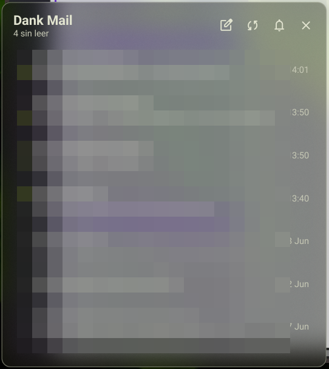

# Dankmail Unread — DMS plugin

Live unread-mail badge and triage popout for the
[DankMaterialShell](https://github.com/AvengeMedia/DankMaterialShell)
bar, powered by [dankmail](https://github.com/arqueon/dankmail).

<p align="center">
  
</p>

## Features

### Bar pill
- **Live unread badge**: a colored capsule with the count (caps at
  `99+`), rendered correctly on horizontal and vertical bars.
- **Icon states**: primary tint while there is unread mail; dimmed
  when the dmail daemon is not running; bell-off icon plus a small
  amber dot while dankmail's do-not-disturb is active.
- **No polling**: the widget keeps two connections to the daemon's
  IPC socket (command + event subscription) and refreshes the moment
  anything changes — new mail, actions taken anywhere, snooze wakes —
  with a 60 s safety poll and automatic reconnection (4 s retry) if
  the daemon goes away.

### Mouse buttons
| Button | Action |
|---|---|
| **Left** | Open the popout |
| **Middle** | Toggle the dankmail window (or start the `dmail` service if it's down) |
| **Right** | Sync now |

### Popout
- **Clickable title**: clicking "Dank Mail" (or its status subtitle)
  opens the app regardless of which mail is focused — and starts the
  service when the daemon is down.
- **Status subtitle**: unread count, "inbox zero", or "daemon off".
- **Header actions**: compose (opens dankmail with the compose modal
  ready), sync now, do-not-disturb toggle, close.
- **Latest inbox mail** (up to 20, scrollable): unread emphasis,
  parsed sender names, per-day/HH:mm timestamps, and an amber star on
  the threads you have starred.
- **Per-message actions on hover** — the notification set: mark
  read/unread, **star/unstar**, archive, trash, **snooze** (uses the
  snooze preset configured in dankmail's settings, same as the
  notification button), open in the webmail.
- **Click a message** to jump straight to it in the triage window.

### Plugin settings
- **Hide when inbox is clear** — collapse the pill at zero unread.
- **Do-not-disturb indicator** — toggle the amber DND dot.

## Requires

[`dankmail`](https://github.com/arqueon/dankmail) (the `dmail`
daemon) installed and set up with at least one account — on Arch,
[`dankmail`](https://aur.archlinux.org/packages/dankmail) /
[`dankmail-git`](https://aur.archlinux.org/packages/dankmail-git)
from the AUR. Everything
speaks the daemon's line-JSON IPC socket
(`$XDG_RUNTIME_DIR/dankmail.sock`).

## Install

Until it lands in the DMS plugin registry:

```sh
git clone https://github.com/arqueon/dms-dankmail \
  ~/.config/DankMaterialShell/plugins/dankmailUnread
```

Then enable **Dankmail Unread** in DMS Settings → Plugins and add the
widget to your bar layout.

## License

GPL-3.0-or-later — see [LICENSE](LICENSE).
